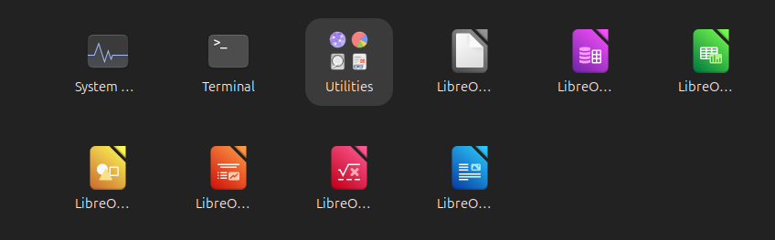

# BRG-29-labs labs report

Day 1a-1

Install virtualbox on the host machine.

Downloaded Ubuntu desktop ISO.

Created a new VM:

RAM:4096 MB
HD:20GB

Completed installation and system configuration.

Day 1a-2

labs:

1.Check internet using Firefox.
2.Open LibreOffice and type a document.
3.Open files.
4.Install a Software in APP center.
5.Practice basic commands.
pwd
ls /
cd /etc
cd
mkdir dir1
cd dir1
touch hello world.text
ls -l
cd ..
**The operation screenshot is shown below: **

